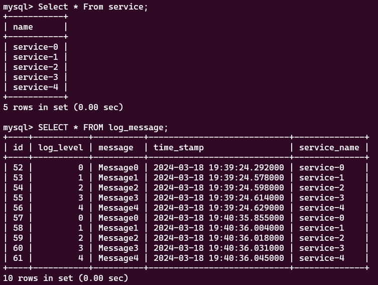

# Logging System for Microservices


## Install Maven
https://maven.apache.org/install.html

## Install grpc-interface into Maven
Go to grpc-interface project folder. Build and install with below command
```
mvn clean install
```

## Install the logger into Maven
Go to logger class library project folder. Build and install with below command
```
mvn clean install
```

# Usage
Use the Logger library to log messages through grpc.

If using Spring framework, You can create a Bean of Logger in your configuration file.

# Examples:
Logs are store in a MySQL table like this -

